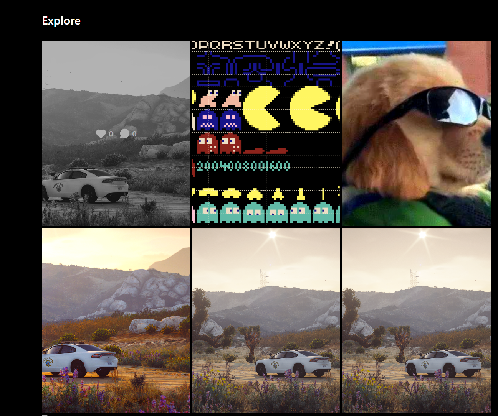

### TECHSTACK


#### API


#### FRONTEND


### ABOUT

This Instagram Clone started as a school project, but I found it intriguing and decided to enhance and expand it further. During my free time, I plan to develop additional features to improve its functionality.

### GET STARTED

Make sure you have node.js (20+)<br/>

_Clone this repo_

```console
git clone https://github.com/SekulDev/instagram_clone.git
```

Go to repo directory

```console
cd instagram_clone
```

Install all dependencies

```console
npm i
```

Copy example of ENV file

```console
cp .env.example .env
```

**Put your environment variables into `.env` file**

Run project in develop mode

```console
npm run dev
```

### FEATURES

-   Base
    -   UI almost copied from real instagram
    -   light / dark mode
    -   English and Polish locales
-   Authorization
    -   Logging to account
    -   Registering new account
    -   Changing password if forgot
    -   Sendning mail to change password
-   Settings
    -   changing / deleting avatar
    -   changing account label
    -   changing biogram
    -   changing password
-   Home page
    -   posts from explore tab but presented in single posts
-   Searching
    -   searching users using Levenshtein algorithm
    -   searching tags if search string is started with "#"
-   Explore Page
    -   recommended posts presented in multiple posts
    -   with tag param, presented recommended posts only with this tag
-   Create modal
    -   uploading files from computer
    -   cropping images to 4/5 format
    -   can add / remove more photos to one post
    -   almost 40 filters to every image
    -   description to post
    -   tags to post with helpers by most popular tags
-   Post modal
    -   can change images with there are more than one
    -   description of post
    -   tags of post (url to explore this tag)
    -   post comments
    -   likes count
    -   possibility to like, comment, and share (copy link to post, but sometimes is bugged idk why)
-   Profile page
    -   followers / following / posts count
    -   possibilty to folow / unfollow user
    -   label and bio of this user
    -   users posts with likes and comments count
-   404 page

### PREVIEW

-   AUTH
<p>
    
    
    
    
</p>

-   NAVBAR
<p>
    
    
    
</p>

-   PAGES
<p>
    
    
    
    
</p>

-   POST MODAL
<p>
    
</p>

-   CREATE POST
<p>
    
    
    
    
</p>

-   LIGHT THEME
<p>
    
</p>

### TODO

-   Reels
-   Messages
-   Stories
-   Unit and integrations tests
-   Docker setup
-   Improve recommendation algorithm, because now is so bad
